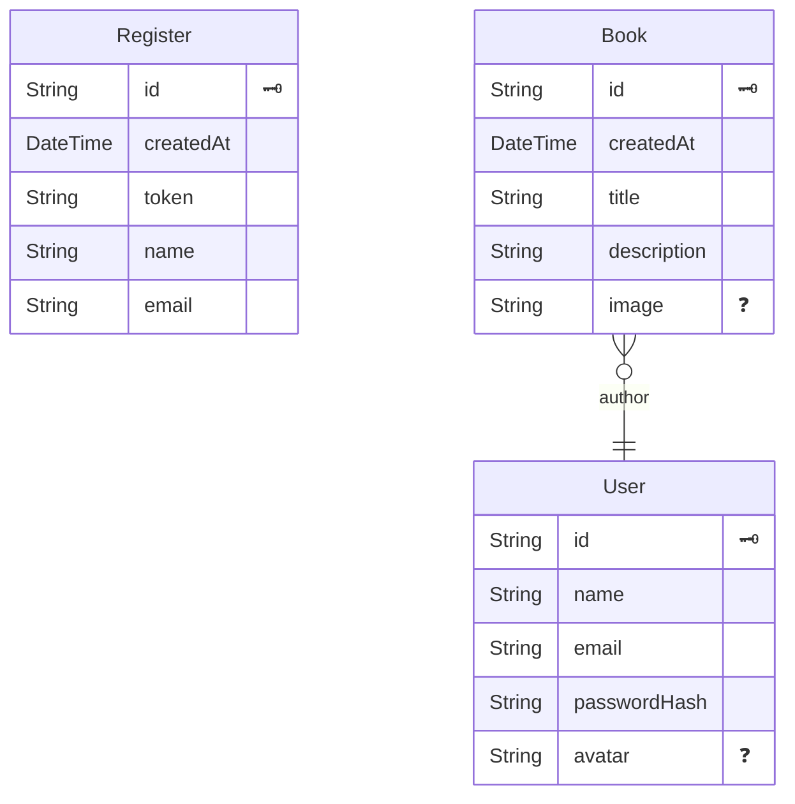

```mermaid
erDiagram

  "User" {
    String id "🗝️"
    String name 
    String email 
    String passwordHash 
    String avatar "❓"
    }
  

  "Register" {
    String id "🗝️"
    DateTime createdAt 
    String token 
    String name 
    String email 
    }
  

  "Book" {
    String id "🗝️"
    DateTime createdAt 
    String title 
    String description 
    String image "❓"
    }
  
    "Book" }o--|| "User" : "author"
```
